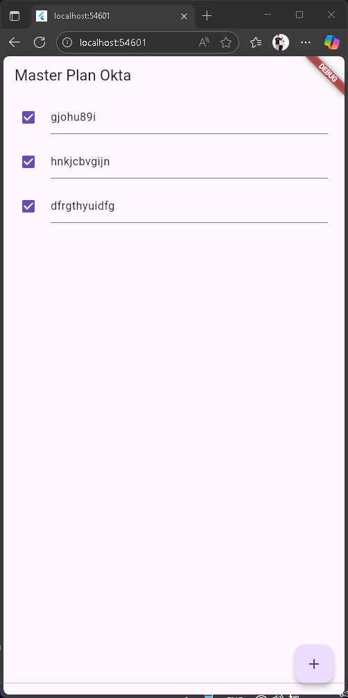
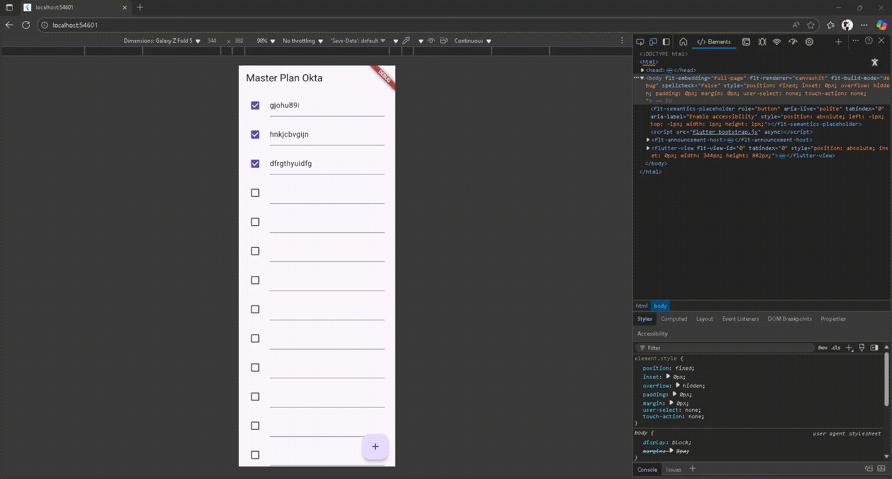
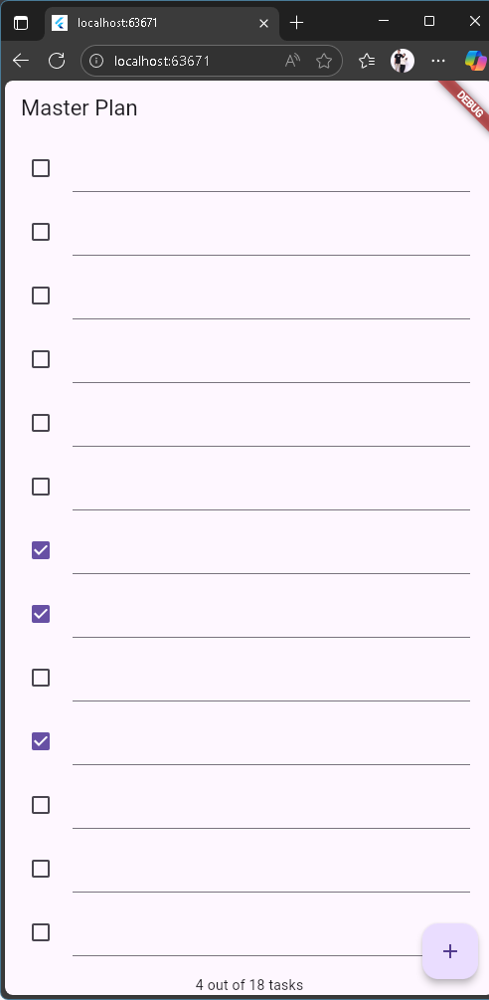
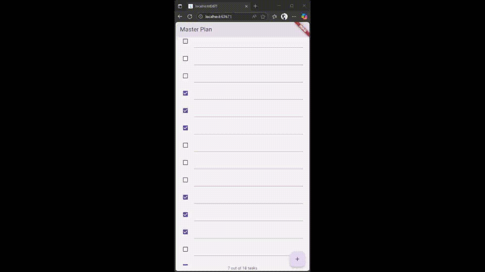

# Master Plan

## Tugas Praktikum 1

2. Jelaskan maksud dari langkah 4 pada praktikum tersebut! Mengapa dilakukan demikian?
- Memisahkan fungsi menjadi beberapa file kemudian menggabungkannya dalam satu file bernama data_layer.dart menggunakan export digunakan untuk mempermudah code maintenance dan meningkatkan performa aplikasi dengan mengurangi jumlah baris pada tiap file kodenya.
3. Mengapa perlu variabel plan di langkah 6 pada praktikum tersebut? Mengapa dibuat konstanta ?
- Variable plan berisi class untuk menyimpan detail plan/task, dibuat agar PlanScreen mempunyai satu objek data yang bisa diakses oleh widget di dalamnya. Konstanta dipilih karena objek Plan bersifat immutable (tidak dapat diubah secara langsung)
4. Lakukan capture hasil dari Langkah 9 berupa GIF, kemudian jelaskan apa yang telah Anda buat!
- 
Sebuah sistem yang mengelola plan secara statis dan menggunakan scrollcontroller agar bisa melakukan scroll ketika jumlah plan melebihi panjang layar
5. Apa kegunaan method pada Langkah 11 dan 13 dalam lifecyle state ?
- Method initState berjalan sekalii saja saat state object pertam akali dibuat. Ini membuat ScrollController akan dijalankan hanya sekali ketika inisialisasi, buka setiap widget dibangun ulang. Begitupula dispose, method ini dipanggil sekali ketika widget dihapus dari tree. Method dispose berfungsi untuk melepas resource yang dipakai agar tidak terjadi memory leak

## Tugas Praktikum 2

2. Jelaskan mana yang dimaksud InheritedWidget pada langkah 1 tersebut! Mengapa yang digunakan InheritedNotifier?
- InheritedNotifier<ValueNotifier<`Plan`>>. Penggunaan InheritedNotifier berfungsi untuk memberi tahu widget anak secara otomatis ketika terjadi perubahan data.
3. Jelaskan maksud dari method di langkah 3 pada praktikum tersebut! Mengapa dilakukan demikian?
- method completedCount berfungsi untuk menghitung jumlah task yang complete, kemudian menjadikannya variabel bertipe int. Sedangkan completnessMessage menghasilkan pesan yang berisi completedCound dari seluruh task yang ada
4. Lakukan capture hasil dari Langkah 9 berupa GIF, kemudian jelaskan apa yang telah Anda buat!
- 
Mengelola plan ke bentuk provide agar aplikasi lebih efisien secara penggunaan memory dan menambahkan message di bagian footer untuk mengetahui berapa task yang sudah dicentang