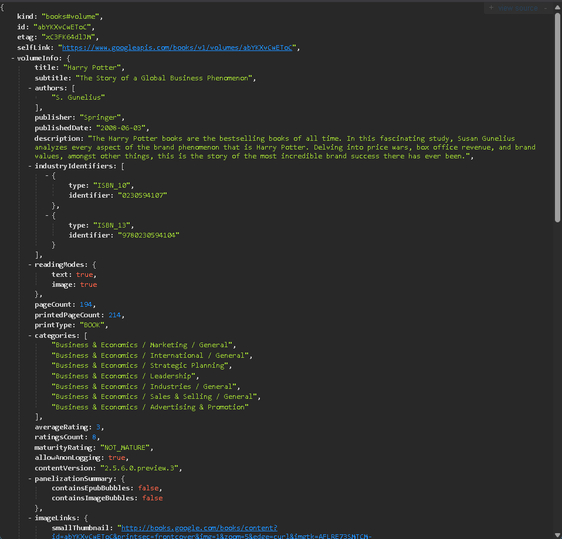
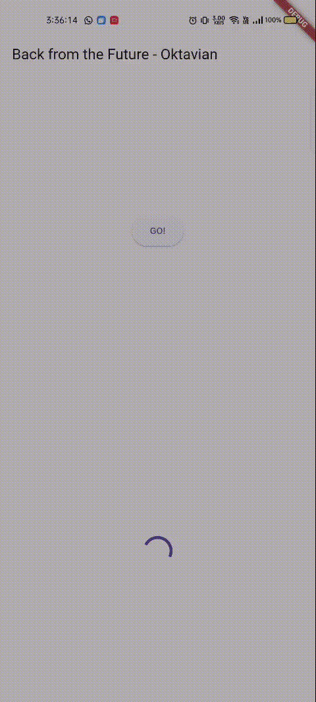
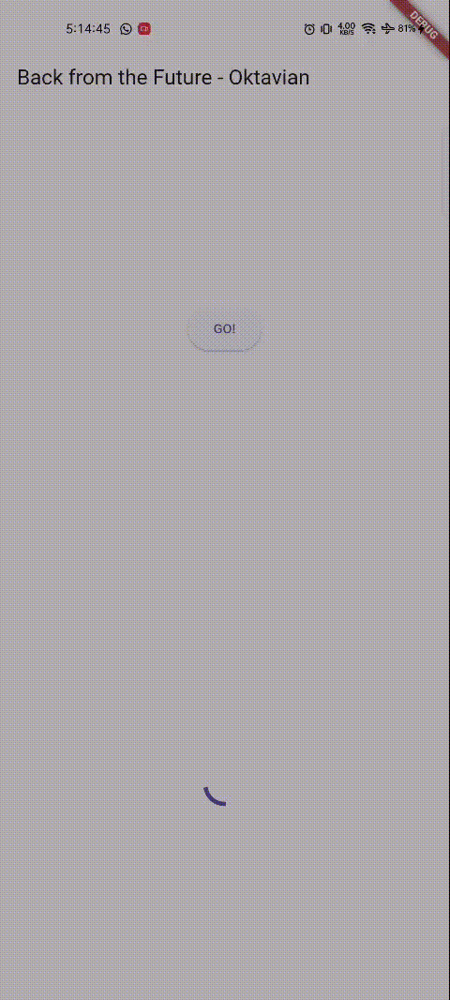
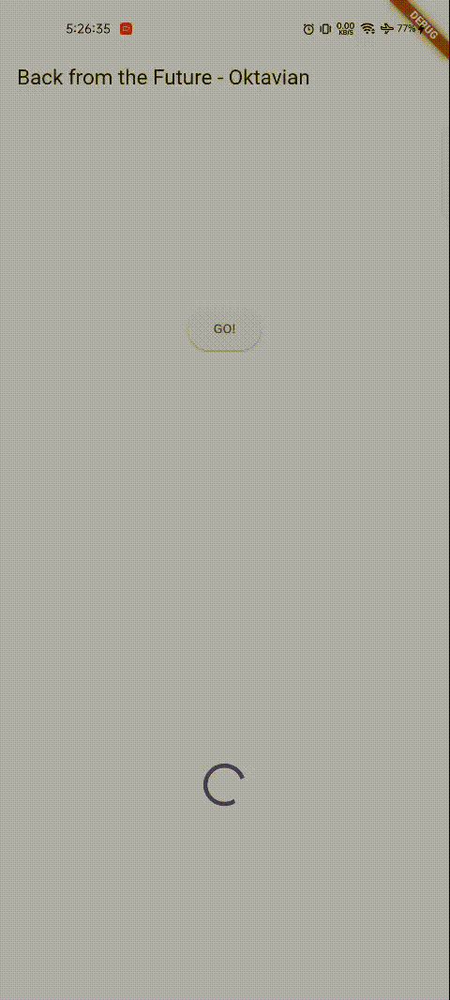
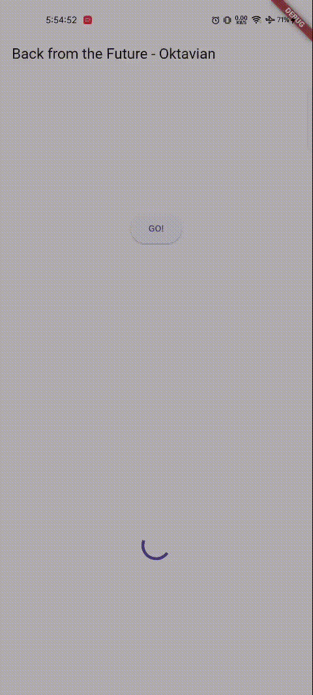
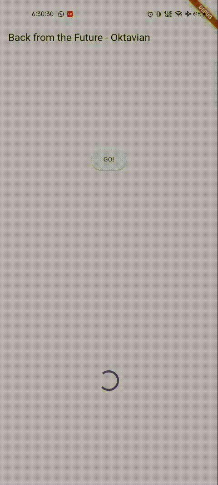
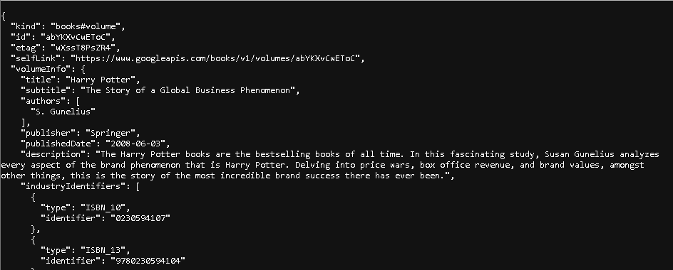
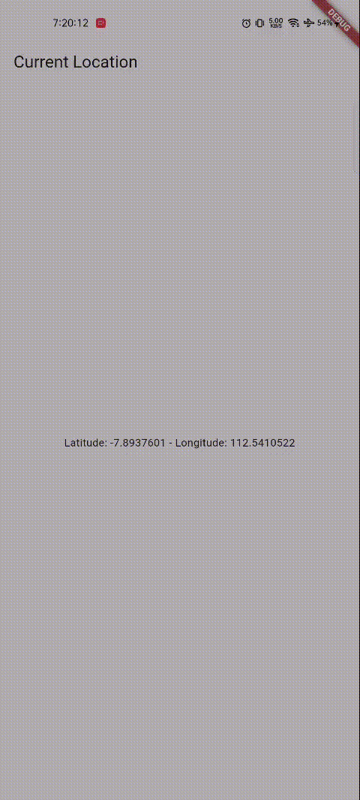
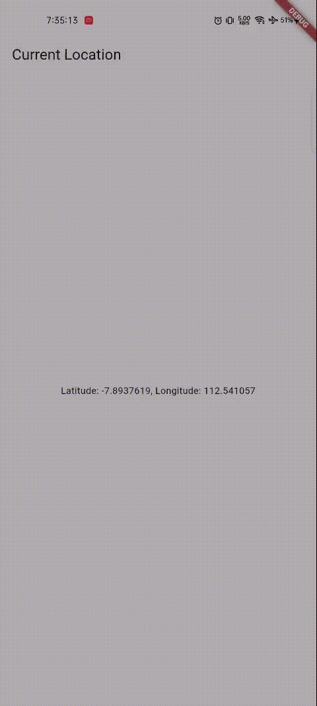

# Books API

## Soal 1
Menambahkan nama panggilan pada title app

```
appBar: AppBar(
title: const Text('Back from the Future - Oktavian'),
),
```

## Soal 2
Mengakses data API google.books

API: [Google API](https://www.googleapis.com/books/v1/volumes/abYKXvCwEToC)



## Soal 3
1. Jelaskan maksud kode langkah 5 tersebut terkait substring dan catchError!
- ```substring``` digunakan untuk mengambil sebagian teks dari hasil value.body. Sebagian teks yang dimaksud diperjelas pada parameter (0,450) yang mengambil karakter pada indeks 0 hingga 449.
- ```catchError``` digunakan untuk menangani kesalahan yang mungkin terjadi selama eksekusi ```getData()```
2. Capture hasil praktikum Anda berupa GIF dan lampirkan di README.
- 

## Soal 4
1. Jelaskan maksud kode langkah 1 dan 2 tersebut!
- Kode return one,two dan three async masing-masing menunggu selama 3 detik untuk kemudian melakukan return angka 1, 2 dan 3. Ketiga return tersebut dipanggil pada fungsi ``` Future count() async``` dan akan melakukan update UI ketika ketiga proses tersebut selesai
2. Capture hasil praktikum Anda berupa GIF dan lampirkan di README.
- 

## Soal 5
1. Jelaskan maksud kode langkah 2 tersebut!
- ```completer``` berisi baris yang mengembalikan calculate melalui ```completer.future```. Kode ini digunakan agar UI tidak menunggu proses ```calculate``` yang memakan waktu 5 detik sebelum memberikan return.
2. Capture hasil praktikum Anda berupa GIF dan lampirkan di README.
- 

## Soal 6
1. Jelaskan maksud perbedaan kode langkah 2 dengan langkah 5-6 tersebut!
- Langkah 6 menambahkan kode untuk menangani error jika terjadi kegagalan
2. Capture hasil praktikum Anda berupa GIF dan lampirkan di README.
- 

## Soal 7
1. Capture hasil praktikum Anda berupa GIF dan lampirkan di README!
- 

## Soal 8
1. Jelaskan maksud perbedaan kode langkah 1 dan 4!
- ```Future.wait()``` merupakan fungsi bawaan dart yang lebih modern dan ringkas. Fungsi itu dapat menjadikan beberapa function menjadi sebuah array. Sedangkan ```FutureGroup``` merupakan class dari package async yang menginisiasi function satu persatu.

## Soal 9
1. Capture hasil praktikum Anda berupa GIF dan lampirkan di README
- 

## Soal 10
1. Panggil method handleError() tersebut di ElevatedButton, lalu run. Apa hasilnya? Jelaskan perbedaan kode langkah 1 dan 4!
- Fungsi ```returnError``` dibuat untuk menampilkan pesan error ketika sebuah baris kode gagal dijalankan. Pada langkah 4, fungsi ```handleError()``` menggunakan ```try...catch...finally``` agar aplikasi tidak crash ketika mendapati error.

## Soal 11
1. Tambahkan nama panggilan Anda pada tiap properti title sebagai identitas pekerjaan Anda.
- ```    return Scaffold(
      appBar: AppBar(title: Text('Current Location - Oktavian')),
      body: Center(child: myWidget),
    );```

## Soal 12 
1. Apakah Anda mendapatkan koordinat GPS ketika run di browser? Mengapa demikian?

    
- Muncul, karena browser juga dapat mengakses lokasi dari laptop
2. Capture hasil praktikum Anda berupa GIF dan lampirkan di README!
- 

## Soal 13
1. Apakah ada perbedaan UI dengan praktikum sebelumnya? Mengapa demikian?
- Tidak ada, hanya waktu tunggu agak lama. Hal ini dikarenakan tidak ada UI yang diubah, hanya memecah fungsi dan menambahkan durasi delay.
2. Capture hasil praktikum Anda berupa GIF dan lampirkan di README!
- 