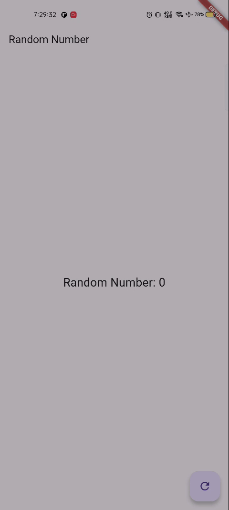

# BLOC Random Okta
## Soal 13
1. Jelaskan maksud praktikum ini ! Dimanakah letak konsep pola BLoC-nya ?
- Letak Business Logic Processnya ada di file ```random_bloc.dart```, meliputi input sink untuk menerima event dari UI, Output Stream untuk mengirim hasil ke UI, mengolah data dengan generate random number kemudian menutup stream dengan ```dispose``` agar tidak terjadi memory leak. BLoC ini memungkinkan UI untuk tidak mengetahui bagaimana data diolah dan hanya mengetahui bahwa ada angka baru dan tinggal menampilkannya
2. Capture hasil praktikum Anda berupa GIF dan lampirkan di README.
- 