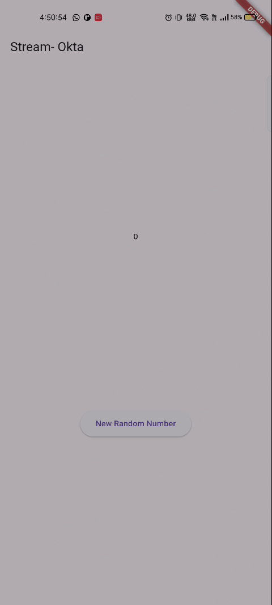

# Stream

## Praktikum 1
### Soal 1
1. Tambahkan nama panggilan Anda pada title app sebagai identitas hasil pekerjaan Anda.
    ```    return Scaffold(
      appBar: AppBar(title: const Text('Stream- Okta')),
      body: Container(decoration: BoxDecoration(color: bgColor)))
    ```
2. Gantilah warna tema aplikasi sesuai kesukaan Anda.
    ``` Color bgColor = Colors.blueGrey; ```
### Soal 2
1. Tambahkan 5 warna lainnya sesuai keinginan Anda pada variabel colors tersebut.
```
  final List<Color> colors = [
    Colors.blueGrey,
    Colors.amber,
    Colors.deepPurple,
    Colors.lightBlue,
    Colors.teal,
    Colors.red,
    Colors.green,
    Colors.pink,
    Colors.orange,
    Colors.cyan,
  ];
```
### Soal 3
1. Jelaskan fungsi keyword ```yield*``` pada kode tersebut!
- Keyword tersebut meneruskan semua isi dari stream ke ke stream ini sehingga semua event akan diteruskan secara otomatis
2. Apa maksud isi perintah kode tersebut?
- Setiap 1 detik menjalankan fungsi int t. Fungsi int t akan bertambah tiap detik dan melakukan loop di daftar colors dan mengirimkan warna saat ini

### Soal 4
1. Capture hasil praktikum Anda berupa GIF dan lampirkan di README.


### Soal 5
1. Jelaskan perbedaan menggunakan listen dan await for!
- Fungsi listen tidak menunggu stream selesai dan dapat menggunakan subscription controller (resume, pause, cancel). Sedangkan await for digunakan pada fungsi async

## Soal 6
1. Jelaskan maksud kode langkah 8 dan 10 tersebut!
- Kode langkah 8 membuat obbjek stream dan mengambil StreamController dari objek tersebut. Stream dari controller kemudian disimpan menjadi variabel dan mendaftarkan listener ke stream agar widget tahu setiap ada data baru. Sedangkan kode pada langkah 10 merupakan fungsi yang membuat angka acak antara 0 sampai 9 dan mengirimkannya ke stream melalui fungsi addNumberToSink dan NumebrStream.
2. Capture hasil praktikum Anda berupa GIF dan lampirkan di README
- 

## Soal 7
1. Jelaskan maksud kode langkah 13 sampai 15 tersebut!
- Menambahkan catch pada fungsi untuk menangkap jika terjadi error dan menghasilkan angka -1 yang dipicu dari onError(error).