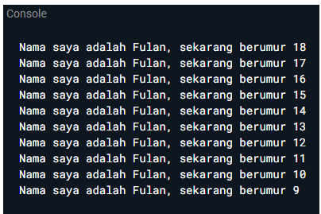
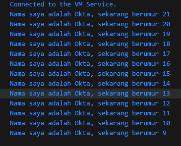

### Soal 1
Modifikasi kode pada baris 3 VS Code agar mendapatkan keluaran berikut

### Jawab
`void main() {`

  `for (int i = 21; i > 8; i--) {`

    `print('Nama saya adalah Okta, sekarang berumur $i');`

  `}`

`}`

Hasil: 

### Soal 2
Mengapa sangat penting untuk memahami bahasa pemrograman Dart sebelum kita menggunakan framework Flutter? Jelaskan!

### Jawab
Bahasa pemrograman Dart merupakan bahasa yang digunakan sepenuhnya oleh flutter untuk menjalankan frameworknya. Jadi, jika belum memiliki pemahaman pada bahasa Dart akan sulit untuk memahami cara kerja widget ataupun menulis logika aplikasi

### Soal 3
Rangkumlah materi dari codelab ini menjadi poin-poin penting yang dapat Anda gunakan untuk membantu proses pengembangan aplikasi mobile menggunakan framework Flutter.

### Jawab
- Kompilasi pada Dart menggunakan 2 metode yaitu JIT dan AOT. JIT memungkinkan kode sumber terkompilasi secara langsung in real time, sedangkan AOT menggunakan garbage collector dan metode native dari dart
- Dart memiliki fitur-fitur OOP seperti encapsulation, inheritance, composition, abstraction, dan polymorphism.
- Operator aritmatika pada dart bekerja seperti banyak bahasa pemrograman lain
- Tergantung dengan jenis operan sisi kirinya, setiap operator akan mengikuti tipe variabelnya
- Fungsi main adalah fungsi pertama yang dicari oleh dart ketika menjalankan kode.

### Soal 4
Buatlah penjelasan dan contoh eksekusi kode tentang perbedaan _Null Safety_ dan _Late variabel_ !

### Jawab
*null safety* digunakan untuk menghindari pembuatan variabel *null* secara tidak sengaja, sedangkan *late variable* hanya menunda inisialisasi variabel (harus bukan null ketika digunakan).

Contoh penggunaan *null safety* dan *late variable*: 
`void main() {`

  `String? nullableVar;       // Bisa null`

  `late String lateVar;       // Harus diinisialisasi sebelum digunakan`

  `print(nullableVar);        // Output: null`

  `// print(lateVar);         // Runtime error: belum diinisialisasi`

  `lateVar = "Hello Dart!";`

  `print(lateVar);            // Output: Hello Dart!`

`}`
