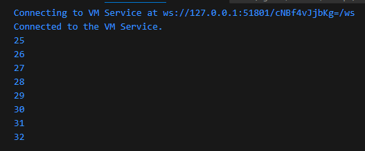

### Langkah 1
Ketik atau salin kode program berikut ke dalam fungsi main().
```
while (counter < 33) {
  print(counter);
  counter++;
}
```

### Langkah 2
Silakan coba eksekusi (Run) kode pada langkah 1 tersebut. Apa yang terjadi? Jelaskan! Lalu perbaiki jika terjadi error.

### Jawab
Error terjadi karena variabel counter tidak pernah diinisialisai. Solusinya inisialisasi variabel counter dan fungsi akan melakukan print untuk tiap angka variabel counter kurang dari 33 yang bertambah 1 nilai tiap perulangan
```
void main() {
  int counter = 25;
  while (counter < 33) {
    print(counter);
    counter++;
  }
}
```



### Langkah 3
Tambahkan kode program berikut, lalu coba eksekusi (Run) kode Anda.
```
do {
  print(counter);
  counter++;
} while (counter < 77);
```
Apa yang terjadi ? Jika terjadi error, silakan perbaiki namun tetap menggunakan do-while.
### Jawab
Variabel counter akan melanjutkan loop dengan nilai saat ini hingga kondisi kurang dari 77 tidak terpenuhi

