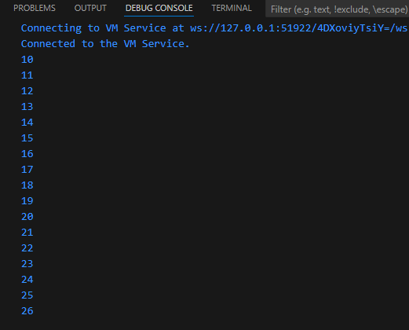
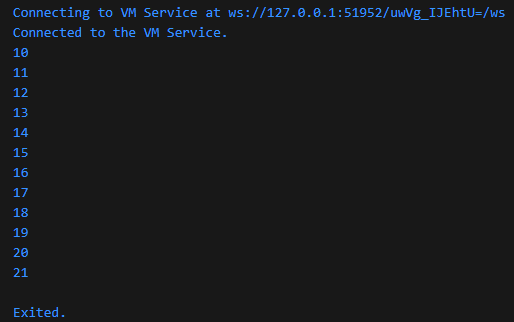

### Langkah 1
Ketik atau salin kode program berikut ke dalam fungsi main().
```
for (Index = 10; index < 27; index) {
  print(Index);
}
```

### Langkah 2
Silakan coba eksekusi (Run) kode pada langkah 1 tersebut. Apa yang terjadi? Jelaskan! Lalu perbaiki jika terjadi error.

### Jawab
Terjadi error karena variabel index tidak konsisten dan tidak memiliki tipe data. Selain itu perulangan tidak menambahkan apapun pada variabel index sehingga menyebabkan infinite loop sehingga harus ditambahkan plus untuk tiap perulangan.
```
void main() {
  for (int index = 10; index < 27; index++) {
    print(index);
  }
}
```



### Langkah 3
Tambahkan kode program berikut di dalam for-loop, lalu coba eksekusi (Run) kode Anda.
```
If (Index == 21) break;
Else If (index > 1 || index < 7) continue;
print(index);
```
Apa yang terjadi ? Jika terjadi error, silakan perbaiki namun tetap menggunakan for dan break-continue.
### Jawab
Variabel index tidak konsisten penamaannya serta if else tidak sesuai dengan penulisan sintaks. Break pada if else akan mengehentikan loop pada angka 21 karena nilai indeks pada nilai 21 memenuhi kondisi
```
if (index == 21) break;
else if (index > 1 || index < 7) continue;
print(index);
```

