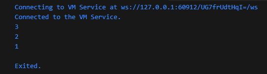
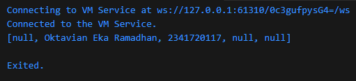

### Langkah 1
Ketik atau salin kode program berikut ke dalam void main().
```
var list = [1, 2, 3];
assert(list.length == 3);
assert(list[1] == 2);
print(list.length);
print(list[1]);

list[1] = 1;
assert(list[1] == 1);
print(list[1]);
```

### Langkah 2
Silakan coba eksekusi (Run) kode pada langkah 1 tersebut. Apa yang terjadi? Jelaskan!

### Jawab


Output pertama akan menghasilkan panjang dari array bernama list, output kedua menampilkan value pada array list index 1. Kemudian array list index 1 diubah valuenya menjadi 1 dan ditampilkan.

### Langkah 3
Ubah kode pada langkah 1 menjadi variabel final yang mempunyai index = 5 dengan default value = null. Isilah nama dan NIM Anda pada elemen index ke-1 dan ke-2. Lalu print dan capture hasilnya.

Apa yang terjadi ? Jika terjadi error, silakan perbaiki.
### Jawab

```
  final List<String?> list = List<String?>.filled(5, null);

  list[1] = "Oktavian Eka Ramadhan";
  assert(list[1] == "Oktavian Eka Ramadhan");
  
  list[2] = "2341720117";
  assert(list[2] == "2341720117");

  print(list);
```

