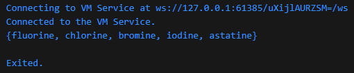
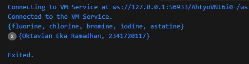

### Langkah 1
Ketik atau salin kode program berikut ke dalam fungsi main().
```
var halogens = {'fluorine', 'chlorine', 'bromine', 'iodine', 'astatine'};
print(halogens);
```

### Langkah 2
Silakan coba eksekusi (Run) kode pada langkah 1 tersebut. Apa yang terjadi? Jelaskan! Lalu perbaiki jika terjadi error.

### Jawab



### Langkah 3
Tambahkan kode program berikut, lalu coba eksekusi (Run) kode Anda.
```
var names1 = <String>{};
Set<String> names2 = {}; // This works, too.
var names3 = {}; // Creates a map, not a set.

print(names1);
print(names2);
print(names3);
```
Apa yang terjadi ? Jika terjadi error, silakan perbaiki namun tetap menggunakan ketiga variabel tersebut. Tambahkan elemen nama dan NIM Anda pada kedua variabel Set tersebut dengan dua fungsi berbeda yaitu .add() dan .addAll(). Untuk variabel Map dihapus, nanti kita coba di praktikum selanjutnya.

Dokumentasikan code dan hasil di console, lalu buat laporannya.
### Jawab

```
   var names1 = <String>{};
  Set<String> names2 = {}; // This works, too.

  names1.add('Oktavian Eka Ramadhan');
  names1.add('2341720117');

  names2.addAll(names1);

  print(names1);
  print(names2);
```

