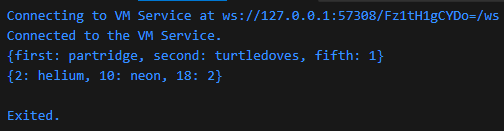
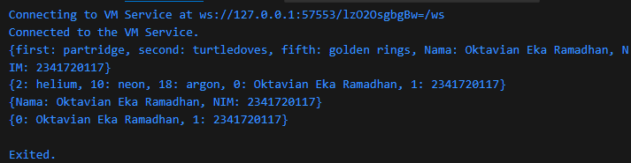

### Langkah 1
Ketik atau salin kode program berikut ke dalam fungsi main().
```
var gifts = {
  // Key:    Value
  'first': 'partridge',
  'second': 'turtledoves',
  'fifth': 1
};

var nobleGases = {
  2: 'helium',
  10: 'neon',
  18: 2,
};

print(gifts);
print(nobleGases);
```

### Langkah 2
Silakan coba eksekusi (Run) kode pada langkah 1 tersebut. Apa yang terjadi? Jelaskan!

### Jawab

Pembuatan map dengan key bertipe string pada var gifts dan key bertipe angka pada var nobleGlass. Lalu isi dari map tersebut ditampilkan

### Langkah 3
Tambahkan kode program berikut, lalu coba eksekusi (Run) kode Anda.
```
var mhs1 = Map<String, String>();
gifts['first'] = 'partridge';
gifts['second'] = 'turtledoves';
gifts['fifth'] = 'golden rings';

var mhs2 = Map<int, String>();
nobleGases[2] = 'helium';
nobleGases[10] = 'neon';
nobleGases[18] = 'argon';
```
Apa yang terjadi ? Jika terjadi error, silakan perbaiki.

Tambahkan elemen nama dan NIM Anda pada tiap variabel di atas (gifts, nobleGases, mhs1, dan mhs2). Dokumentasikan hasilnya dan buat laporannya!
### Jawab
Setiap key yang dipanggil akan mengisi value dari key yang sama.
```
  var mhs1 = Map<String, String>();
  gifts['first'] = 'partridge';
  gifts['second'] = 'turtledoves';
  gifts['fifth'] = 'golden rings';

  var mhs2 = Map<int, String>();
  nobleGases[2] = 'helium';
  nobleGases[10] = 'neon';
  nobleGases[18] = 'argon';

  var maps = [gifts, nobleGases, mhs1, mhs2];

  for (var map in maps) {
    if (map is Map<String, dynamic>) {
      map['Nama'] = 'Oktavian Eka Ramadhan';
      map['NIM'] = '2341720117';
    } else {
      map[0] = 'Oktavian Eka Ramadhan';
      map[1] = '2341720117';
    }
    print(map);
  }
```

