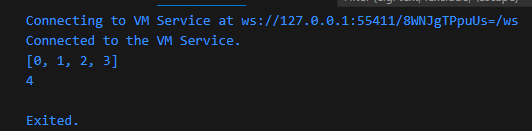
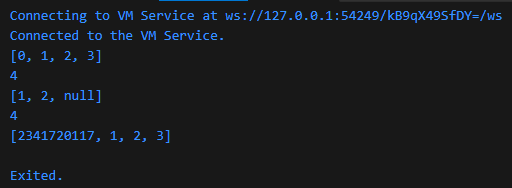
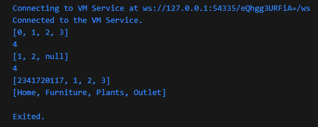
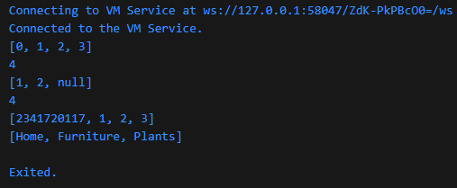
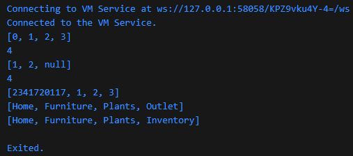
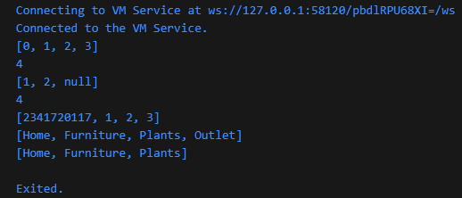
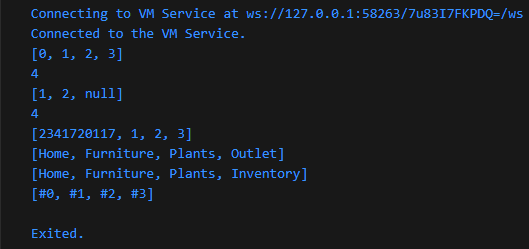

### Langkah 1
Ketik atau salin kode program berikut ke dalam fungsi main().
```
var list = [1, 2, 3];
var list2 = [0, ...list];
print(list1);
print(list2);
print(list2.length);
```

### Langkah 2
Silakan coba eksekusi (Run) kode pada langkah 1 tersebut. Apa yang terjadi? Jelaskan! Lalu perbaiki jika terjadi error.

### Jawab


Terjadi error karena list1 tidak pernah diinisialisasi. Sehingga list1 harus dihapus
```
void main() {
  var list = [1, 2, 3];
  var list2 = [0, ...list];
  //print(list1);
  print(list2);
  print(list2.length);
}
```
### Langkah 3
Tambahkan kode program berikut, lalu coba eksekusi (Run) kode Anda.
```
list1 = [1, 2, null];
print(list1);
var list3 = [0, ...?list1];
print(list3.length);
```
Apa yang terjadi ? Jika terjadi error, silakan perbaiki.

Tambahkan variabel list berisi NIM Anda menggunakan Spread Operators. Dokumentasikan hasilnya dan buat laporannya!
### Jawab
Operator spread dengan null safety kurang direkomendasikan karena list tidak akan bisa berisi null.
```
  var list1 = [1, 2, null];
  print(list1);
  var list3 = [0, ...list1];
  print(list3.length);

  var nim = [2341720117, ...list];
  print(nim);
```



### Langkah 4
Tambahkan kode program berikut, lalu coba eksekusi (Run) kode Anda.
```
var nav = ['Home', 'Furniture', 'Plants', if (promoActive) 'Outlet'];
print(nav);
```
Apa yang terjadi ? Jika terjadi error, silakan perbaiki. Tunjukkan hasilnya jika variabel promoActive ketika true dan false.
### Jawab
Variabel promoActive perlu diinisialisasi terlebih dahulu dengan tipe data boolean(true/false)
```
  var promoActive = true;
  var nav = ['Home', 'Furniture', 'Plants', if (promoActive) 'Outlet'];
  print(nav);
```
promoActive = true

promoActive = false


### Langkah 5
Tambahkan kode program berikut, lalu coba eksekusi (Run) kode Anda.
```
var nav2 = ['Home', 'Furniture', 'Plants', if (login case 'Manager') 'Inventory'];
print(nav2);
```
Apa yang terjadi ? Jika terjadi error, silakan perbaiki. Tunjukkan hasilnya jika variabel login mempunyai kondisi lain.
### Jawab
```
  var login = 'Manager';
  var nav2 = ['Home', 'Furniture', 'Plants', if (login case 'Manager') 'Inventory'];
  print(nav2);
```

Variabel login dengan value selain Manager


### Langkah 6
Tambahkan kode program berikut, lalu coba eksekusi (Run) kode Anda.
```
var listOfInts = [1, 2, 3];
var listOfStrings = ['#0', for (var i in listOfInts) '#$i'];
assert(listOfStrings[1] == '#1');
print(listOfStrings);
```
Apa yang terjadi ? Jika terjadi error, silakan perbaiki. Jelaskan manfaat Collection For dan dokumentasikan hasilnya.
### Jawab
Collection for berguna untuk melakukan loop langsung dari variabel sehingga mengurangi baris kode
