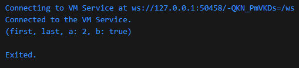
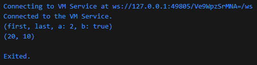
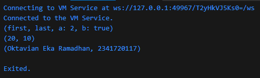
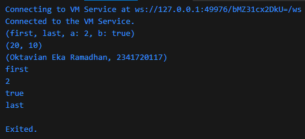

### Langkah 1
Ketik atau salin kode program berikut ke dalam fungsi main().
```
var record = ('first', a: 2, b: true, 'last');
print(record)
```

### Langkah 2
Silakan coba eksekusi (Run) kode pada langkah 1 tersebut. Apa yang terjadi? Jelaskan! Lalu perbaiki jika terjadi error.

### Jawab

Line print tidak memiliki semicolon, sehingga harus ditambahkan semicolon di akhir line.
```
void main() {
  var record = ('first', a: 2, b: true, 'last');
  print(record);
}
```

### Langkah 3
Tambahkan kode program berikut di luar scope void main(), lalu coba eksekusi (Run) kode Anda.
```
(int, int) tukar((int, int) record) {
  var (a, b) = record;
  return (b, a);
}
```
Apa yang terjadi ? Jika terjadi error, silakan perbaiki. Gunakan fungsi tukar() di dalam main() sehingga tampak jelas proses pertukaran value field di dalam Records.
### Jawab

```
void main() {
  var record = ('first', a: 2, b: true, 'last');
  print(record);

  print(tukar((10, 20)));
}

(int, int) tukar((int, int) record) {
  var (a, b) = record;
  return (b, a);
}
```



### Langkah 4
Tambahkan kode program berikut di luar scope void main(), lalu coba eksekusi (Run) kode Anda.
```
// Record type annotation in a variable declaration:
(String, int) mahasiswa;
print(mahasiswa);
```
Apa yang terjadi ? Jika terjadi error, silakan perbaiki. Inisialisasi field nama dan NIM Anda pada variabel record mahasiswa di atas. Dokumentasikan hasilnya dan buat laporannya!
### Jawab
```
  (String, int) mahasiswa;
  mahasiswa = ("Oktavian Eka Ramadhan", 2341720117);
  print(mahasiswa);
```



### Langkah 5
Tambahkan kode program berikut di dalam scope void main(), lalu coba eksekusi (Run) kode Anda.
```
var mahasiswa2 = ('first', a: 2, b: true, 'last');

print(mahasiswa2.$1); // Prints 'first'
print(mahasiswa2.a); // Prints 2
print(mahasiswa2.b); // Prints true
print(mahasiswa2.$2); // Prints 'last'
```
Apa yang terjadi ? Jika terjadi error, silakan perbaiki. Gantilah salah satu isi record dengan nama dan NIM Anda, lalu dokumentasikan hasilnya dan buat laporannya!
### Jawab
Record bersifat immutable sehingga ketika sudah diinisialisasi, record tidak akan bisa diubah atau dimodifikasi. 
