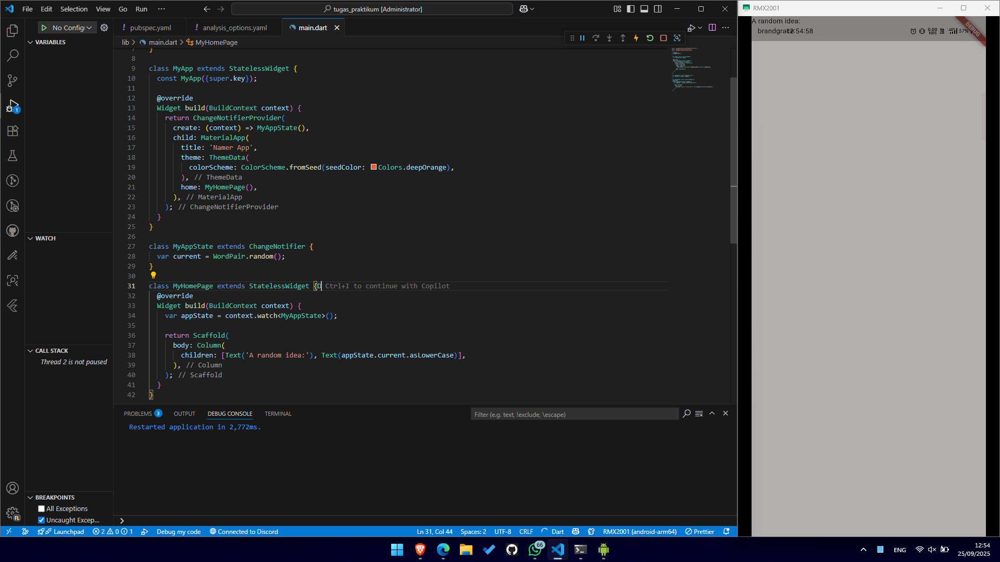
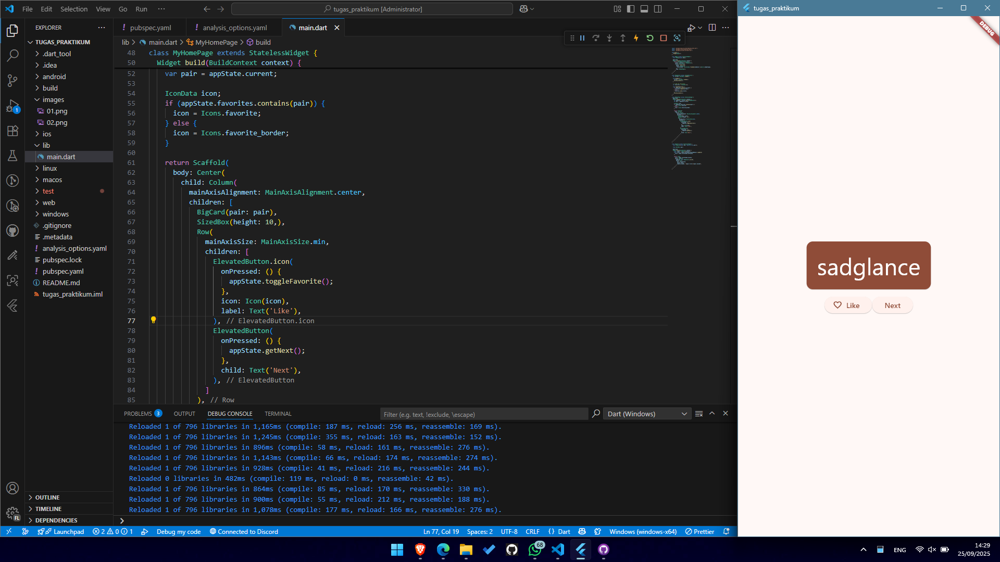
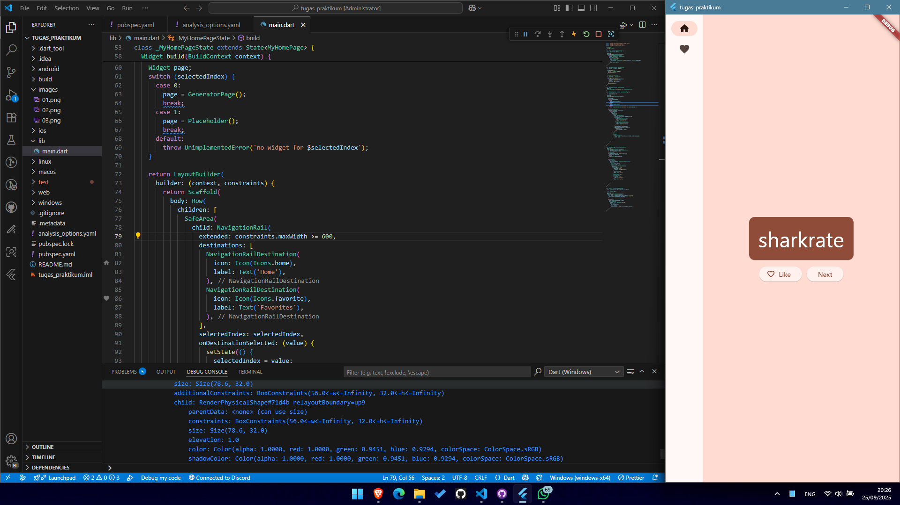
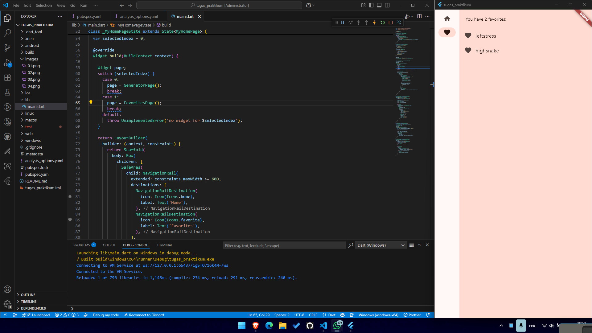

# Tugas Praktikum

A new Flutter project.

## Langkah 1: Add a Button

## Langkah 2: Make the app prettire

## Langkah 3: Add functionality

## Langkah 4: Add navigation rail

## Langkah 5: Add a new page
