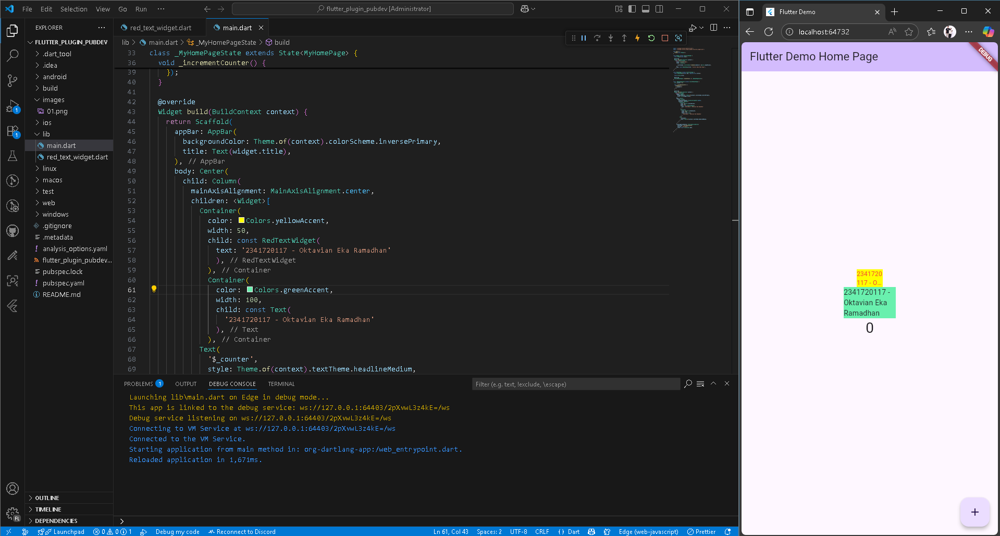

# flutter_plugin_pubde

NIM: 2341720117
Nama: Oktavian Eka Ramadhan

## Tugas Praktikum

1. Selesaikan Praktikum tersebut, lalu dokumentasikan dan push ke repository Anda berupa screenshot hasil pekerjaan beserta penjelasannya di file README.md!

- Penambahan plugin auto_size_text akan meringkas teks panjang menjadi sesuai dengan width container yang diberikan.
2. Jelaskan maksud dari langkah 2 pada praktikum tersebut!
- Terminal akan memanggil fungsi flutter untuk secara otomatis menambahkan (add) plugin auto_sized_text pada pubspec.yaml agar dapat langsung dipakai pada projek
3. Jelaskan maksud dari langkah 5 pada praktikum tersebut!
- Deklarasi String dengan nama variabel text bertipe String dan tidak dapat diubah. Kemudian membuat konstruktor untuk deklarasi class tersebut ketika akan digunakan
4. Pada langkah 6 terdapat dua widget yang ditambahkan, jelaskan fungsi dan perbedaannya!
- Fungsi Text merupakan fungsi bawaan widget dari flutter untuk menampilkan teks yang akan mengikuti style dari tema default aplikasi. Sedangkan RedTextWidget merupakan fungsi custom untuk widget yang telah dibuat secara manual/custom untuk melakukan hal tertentu. Pada fungsi tersebut hal khusus yang dilakukan adlaah memberi autosizetext dengan warna merah, ukuran 14 dan maksimal 2 baris.
5. Jelaskan maksud dari tiap parameter yang ada di dalam plugin auto_size_text berdasarkan tautan pada dokumentasi [ini](https://pub.dev/documentation/auto_size_text/latest/)!
- String text => bertipe required berisi teks yang akan ditampilkan
- TextStyle? style => Style dari teks yang diberikan
- int? maxLines => Batas maksimal baris yang ditampilkan
- TextOverflow? overflow => Bagaimana teks akan ditmpilkan jika tidak muat
- double minFontSize => Ukuran font terkecil yang diperbolehkan
- double? stepGranularity => Besaran pengurangan ukuran font saat mencari ukuran yang muat
- bool wrapWords => Apakah diperbolehkan memecah kata ketika membungkus baris?
- TextAlign? textalign => perataan teks (kiri, kanan, tengah dll.)
- TextDirection? textdirection => Arah teks(LTR/RTL)
- Locale? locale => Lokal (untuk pengaturan karakter)
- StrutStyle? strutstyle => Menentukan gaya strut (jarak antar baris dsb)
- TextWidthBasis? textwidthbasis => Bagaimana lebar baris dihitung
- Key? key => Key widget 